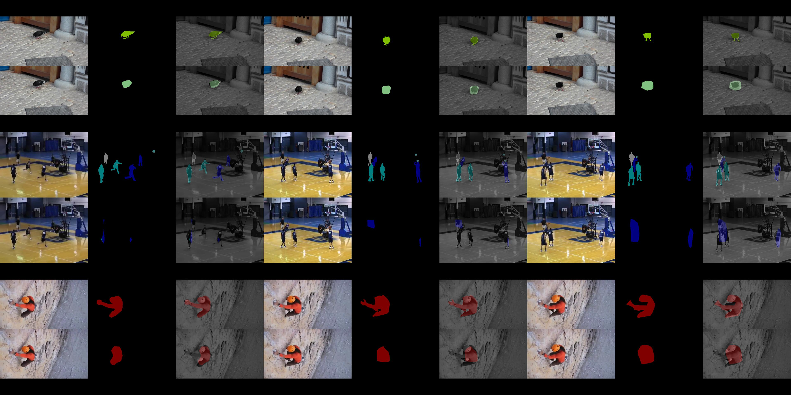

# csc_249_final_proj_a2d_seg 

Actor-Action Segmentation

## Task description 
In this task, you are required to do fully-supervised image semantic segmentation.

The task equals to do pixel-level classification -- to predict the class label for each pixel of an image.

There are 44 categories, including background. Each category is a pair of (actor, action).

The following is the requirements for this task. By default, the working directory is the project root directory

## A basline 
This baseline is implemented by [FCN](https://www.cv-foundation.org/openaccess/content_cvpr_2015/papers/Long_Fully_Convolutional_Networks_2015_CVPR_paper.pdf).
#### Accuracy and time analysis 
| epoch | miou%(val/test) | class accuracy%(val/test) | train time(h) |
|-------|-----------------|---------------------------|---------------|
| 33    | 21.33/-         | 32.16/-                   |3.0            |
| 47    | 23.37/22.96     | 32.77/32.41               |4.2            |

#### Qualitative Example
Segmentation Visualization Result at epoch 33 and 47. The first row shows ground truth, the second row shows our results.

Epoch 33


Epoch 47


## Dataloader 

We have provided data loader for you. Test the data loader by

```bash
python loader/a2d_dataset.py
```


## Evaluation
For evaluation of the validation and test set, you need to evaluate them with our provided evaluation code `a2d_eval.py`.
The ground truth label for the validation set is provided, however, test label are not. Hence, 
you need to take cautions with the following steps for evaluation:

1. You **cannot** shuffle the loading order of the test set.

2. For test set, you need to store the predicted masks with the image loading order into a python list
   , e.g. [mask_1, mask_2, ..., mask_n], where each mask_i has the same height and width with the input image_i, e.g. the input image_i with shape (h, w, 3) and the mask_i with shape (h, w). The value of mask_i is interger ranging [0, 43] ,indicating 44 classes, with value type **np.uint8**.

3. After you stored the masks in a list, you need to dump the list into pickle file so as to hand it in.

    Please use the following command to store the list  
    ```python
    import pickle
    
    # A series of operations to get the mask list as mask_list
    
    with open(save_file_name, 'wb') as f:
        pickle.dump(mask_list, f)
        
    # where save_file_name is the name of the file you want to dump the list to. Usually, you will name the save_file_name with extention .pkl
    
    ```
    The saved val masks should be around 205M, and test mask should be around 163M.

4. You need to evaluate the validation set using the provided evaluation script `eval.py`. The way to use evaluate your segmentation result is 

    ```bash
    python model/eval.py --gt_label $YOUR_GT_MASK_FILE --pred_label $YOUR_PRED_MASK_FILE
    ```

6. Check the validity of your predicted mask result **before submission** by running

    ```bash
    python util/check_test_mask.py --masks $PATH_TO_YOUR_MASKS
    ```

  

## Submission 
For submission, you need to name your predicted mask file as `test_mask.pkl` and put it at the project root directory. 
Also you need to submitted all the scripts leading to your result.